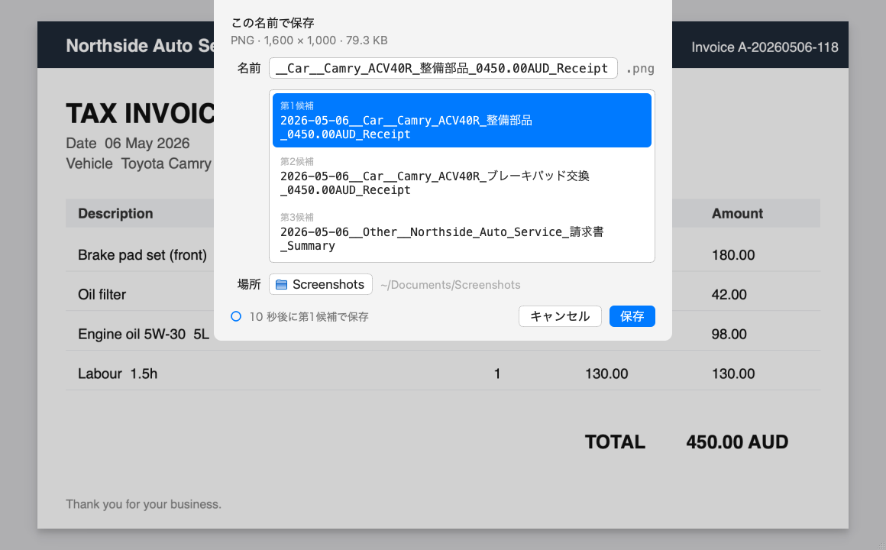
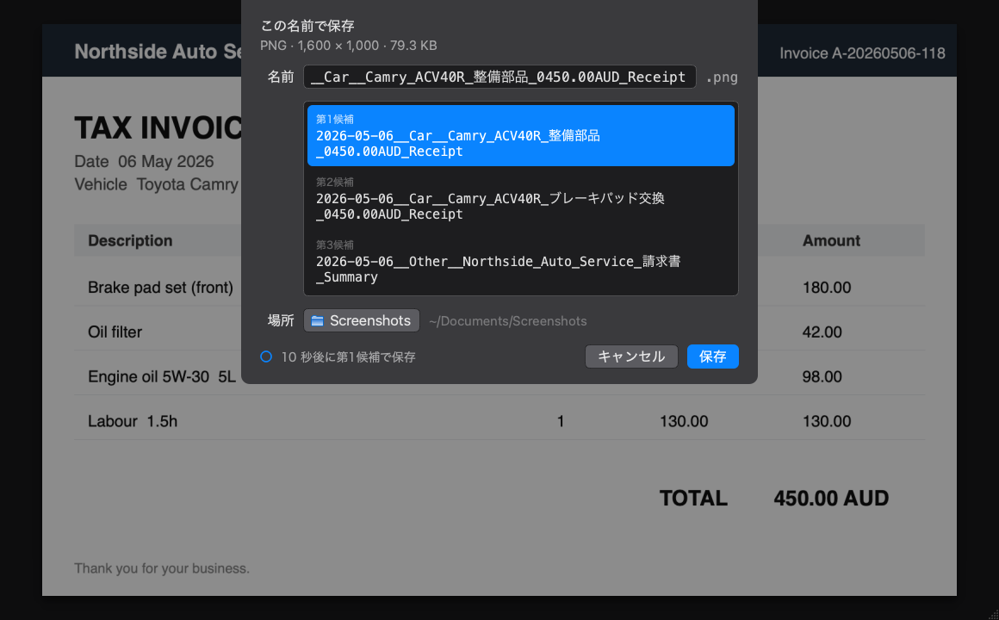

# Smart Renamer

Macで撮影したスクリーンショットをリアルタイムに自動検知し、Google Gemini (3.1 Flash Lite) のOCR機能とLLMを活用して、内容（領収書、財務データ、学習教材など）に合わせた最適なファイル名を提案・自動リネームするバックグラウンドツールです。

リネーム候補は macOS 純正の保存シートと同じ作法で提示されます。キーボード（`↑` `↓` `tab` `return`）だけで完結し、指定したディレクトリへリネームして移動します。

| ライト | ダーク |
| --- | --- |
|  |  |

※ プレビューに写っているのは説明用に生成した架空の請求書です。


## 🌟 主な特長

- **リアルタイム監視**: macOS特有のスクショ生成挙動（一時ファイルからのリネーム発生）を `watchdog` で確実に検知。
- **高精度な候補生成**: 画像内のテキストをOCR解析し、Gemini API（`gemini-3.1-flash-lite`）により文脈に沿ったファイル名候補（最大3件）を即座に提案。
- **保存シート方式のUI**: macOS純正の保存シートと同じ作法。システムのライト／ダークに追従し、残り時間はリングで示す。
- **キーボードナビゲーション対応**: `↑` / `↓` で候補を選び、`tab` で名前を書き換え、`return` で確定、`esc` でキャンセル。キーボードから手を離さずに1秒でリネームが完了。
- **元ファイルの日付を優先**: 過去に撮ったスクショでも、ファイル名や作成日時から拾った日付を候補に使う。本日の日付の候補も1件残るので、どちらも選べる。
- **自動フォールバック**: API制限やタイムアウト発生時は、日付＋4桁連番（例: `2026-07-21__0001_Capture.png`）で自動保存。
- **超軽量常駐 (launchd)**: macOS標準のバックグラウンド管理（`launchd`）に対応。待機時CPU/GPU消費 0.0%、メモリ約20〜30MBの省電力設計。
- **アイドルタイムアウト**: 一定時間スクショが無ければ自動終了し、常駐プロセスを残さない（`config.yaml` の `ui.idle_timeout_minutes`、デフォルト30分）。次のスクショ撮影時に `launchd` の `WatchPaths` で自動復帰。
- **プレビュー表示**: リネーム候補と一緒に対象ファイルの中身を表示。ウィンドウは自由にリサイズできる。
- **手動リネーム**: `--rename` で任意のファイル・フォルダをその場でリネーム。Finderの右クリックからも実行可能。候補の選択に加えて**自分で名前を書き換えられる**。`pdf` / `jpg` / `heic` にも対応。


## 🚀 1. セットアップ

macOS専用です（Vision framework / PyObjC / PyQt6 に依存）。

**設置場所は `~/Documents` / `~/Desktop` / `~/Downloads` の外にしてください。** この3つはmacOSの保護対象（TCC）で、Finderの右クリックからリネームを実行するプロセスが読み取れず失敗します。ホーム直下（`~/smart-renamer` など）が無難です。常駐だけなら保護対象でも動きますが、右クリックが使えません。

事前に [Google AI Studio](https://aistudio.google.com/apikey) でGemini APIキー（`AIza...` から始まる文字列）を取得しておいてください。

```bash
cd ~/smart-renamer
./setup.sh
```

途中でAPIキーの入力を求められます。貼り付けて `Enter` を押すと `.env` に保存されます。

`setup.sh` は以下を全て行います。

| やること | 内容 |
| --- | --- |
| 仮想環境 | `.venv` の作成と `requirements.txt` のインストール |
| APIキー | `.env` の作成（既にキーがあれば触りません） |
| 常駐登録 | `.plist` を生成して `launchd` に登録。ログイン時に自動で動きます |
| 右クリック | Finderの「サービス」に `Rename with Gemini` を登録 |

パスは全てスクリプトが埋めるため、プロジェクトをどこに置いても構いません。

**何度実行しても安全です。** `config.yaml` の `watch_dir` を変えた後や、プロジェクトを別の場所へ移動した後は、`./setup.sh` を再実行すれば設定が追従します。

※ 監視するフォルダや保存先、命名規則を変えたい場合は `config.yaml` を編集してください。


## 💡 2. 使い方 (Usage)

セットアップが済んでいれば常駐は既に動いています。何もせずスクショを撮るだけです。

### 実行の流れ

1. **スクショ撮影**: Macの標準機能（`Cmd + Shift + 3` または `4`）でスクリーンショットを撮影します。
2. **自動検知とAI処理**: プログラムが画像を検知し、GeminiにOCRとファイル名の生成をリクエストします。
3. **ポップアップ確認**: 画面にリネーム候補の保存シートが表示されます。
4. **保存**: 候補を選んで `return`（またはタイムアウト）で確定すると、`config.yaml` で指定したフォルダ（デフォルトは `~/Documents/Screenshots`）にリネームされて移動します。

### ダイアログの操作

| キー | 動作 |
| --- | --- |
| `↑` `↓` | 候補を選ぶ |
| `tab` | 名前欄にカーソルを入れて自分で書き換える。自動保存は止まる |
| `return` | 名前欄の内容で確定する |
| `esc` | キャンセル（監視モードではファイルは元の場所に残る） |

候補はクリックでも選べます。何も操作しないまま `config.yaml` の `ui.timeout_seconds` が経過すると、選択中の候補で自動保存されます。残り時間は左下のリングとテキストで表示され、**候補を選び直すたびにカウントは最初に戻ります。**

#### 候補の日付について

OCRで本文から日付を読み取れた場合はその日付が使われます。読み取れなかった場合は元ファイルの日付（ファイル名に含まれる日付、無ければ作成日時）が使われ、**本日の日付の候補も1件残ります。** 過去のスクショをリネームするときは元の日付、撮り直したものは本日の日付、とどちらも選べます。

### 手動で起動する

常駐させず、ターミナルで動きを見ながら試したい場合。

```bash
.venv/bin/python main.py
```

```text
👀 監視を開始しました: /Users/you/Desktop
終了する場合は Ctrl+C を押してください。
```

終了は `Ctrl + C` です。

### 既存ファイルを手動でリネームする

他のフォルダにあるファイルや、一度リネームしたファイルを付け直したい場合は `--rename` を使います。

```bash
.venv/bin/python main.py --rename ~/Documents/Screenshots/2026-08-18__SBI__口座管理_Capture.png
.venv/bin/python main.py --rename ~/Downloads          # フォルダ直下のファイルをまとめて
```

- 対応形式は `png` / `jpg` / `jpeg` / `heic` / `pdf`
- **その場でリネームします。** 監視モードと違い `save_dir` へは移動しません
- フォルダを渡した場合、**直下のファイルのみ**が対象です（サブフォルダは見ません）
- タイムアウトはありません。候補を選ぶか、`tab` で書き換えて `return` で確定します
- 複数件のときは `3 / 50` の進捗が出ます。`esc` でその1件をスキップ、「すべて中止」で残り全部を中止


## 🖱 3. Finderの右クリックからリネームする

`setup.sh` が Automator のサービスを `~/Library/Services/Rename with Gemini.workflow` に作成済みです。Finderでファイルやフォルダを選んで **右クリック →「サービス」→「Rename with Gemini」** で実行できます。

### メニューのどこに出るか

macOS の右クリックメニューには「クイックアクション」と「サービス」の2つのサブメニューがあり、**登録方法によって出る場所が変わります。**

| 登録方法 | 出る場所 | 並び順 | 自動登録 |
| --- | --- | --- | --- |
| Automator（`setup.sh`） | 「サービス」 | 名前順で固定 | できる |
| ショートカット.app | 「クイックアクション」 | 変えられる | できない（GUI操作が必要） |

「クイックアクション」は「サービス」より上に表示され、**システム設定 → 一般 → ログイン項目と機能拡張 → Finder** で並び順を変えられます。一番上に置きたい場合はショートカット.app で登録してください。

Automator のサービスは `setup.sh` から自動生成できる代わりに、「サービス」サブメニュー内の名前順に固定されます。

### メニューに出てこない場合

- Finderを再起動する（`killall Finder`）
- **システム設定 → 一般 → ログイン項目と機能拡張**（macOSのバージョンによっては「プライバシーとセキュリティ → 機能拡張」）で、`Rename with Gemini` にチェックが入っているか確認する

### `Operation not permitted` で失敗する場合

```
PermissionError: [Errno 1] Operation not permitted: '/Users/you/Documents/smart-renamer/.venv/pyvenv.cfg'
```

プロジェクトを `~/Documents` / `~/Desktop` / `~/Downloads` に置いている場合に出ます。サービスを実行する `WorkflowServiceRunner` がこれらのフォルダを読めないためです。

**プロジェクトを保護対象外の場所へ移してください。**

```bash
launchctl bootout gui/$(id -u)/com.user.smart_renamer
mv ~/Documents/smart-renamer ~/smart-renamer
~/smart-renamer/setup.sh
```

`setup.sh` が新しいパスで plist と サービス を貼り直します。

権限を与えて解決しようとしても回避できません。`WorkflowServiceRunner.xpc` はフルディスクアクセスの選択ダイアログで選べず、`osascript` の `do shell script` を挟んでも TCC の帰属は変わりませんでした（macOS 26 で確認）。

### ショートカット.app で登録する場合

「クイックアクション」に出したい場合、または並び順を変えたい場合はこちらです。`setup.sh` が作ったサービスは `rm -rf ~/Library/Services/"Rename with Gemini.workflow"` で削除できます。

1. **ショートカット.app** を開き、新規ショートカットを作成
2. 「クイックアクション」として登録し、**受け取る項目を「ファイルとフォルダ」**、**「Finder」から使用可能** に設定

   ※ この設定項目の名前・場所はmacOSのバージョンによって変わる。上記はおおよその目安として、実際の画面の文言に従うこと
3. アクション「**シェルスクリプトを実行**」を追加し、以下を設定
   - 入力の引き渡し方法: **引数として**
   - シェルスクリプト（`/path/to/smart-renamer` は実際にこのプロジェクトを置いた場所に置き換える）:

```bash
/path/to/smart-renamer/.venv/bin/python /path/to/smart-renamer/main.py --rename "$@"
```

4. ショートカットに名前を付けて保存（例: `Rename with Gemini`）

   この名前がFinderの右クリックメニューにそのまま表示されます。
5. **システム設定 → 一般 → ログイン項目と機能拡張 → Finder** で並び順を一番上にする


## ⚙️ 4. 常駐の管理 (launchd)

`setup.sh` が `~/Library/LaunchAgents/com.user.smart_renamer.plist` を登録済みです。

```bash
# 動作確認
launchctl print gui/$(id -u)/com.user.smart_renamer

# ログ確認
cat app.log
cat app_error.log

# 停止
launchctl bootout gui/$(id -u) ~/Library/LaunchAgents/com.user.smart_renamer.plist

# 再起動（plistを変えていない場合）
launchctl kickstart -k gui/$(id -u)/com.user.smart_renamer
```

`plist` を作り直したい場合は `./setup.sh` を再実行してください（`bootout` してから登録し直します）。

### うまく動かないとき

| 症状 | 確認すること |
| --- | --- |
| `Bootstrap failed: 5: Input/output error` | 既に登録済み。`bootout` してから `bootstrap` する |
| ファイル名が全て `0001_Capture.png` になる | `.env` の `GEMINI_API_KEY` を確認。未設定なら起動時に `app.log` にエラーが出る |
| ポップアップが出ない | `app.log` / `app_error.log` を確認 |
| 右クリックに出てこない | 「クイックアクション」ではなく「サービス」を見る。`killall Finder` |
| 右クリックが `Operation not permitted` | プロジェクトが `~/Documents` などの保護対象にある。外へ移す（→ 3章） |


## 📎 付録: 手動セットアップ

`setup.sh` を使わず自分で組み立てる場合の手順です。

### A-1. 仮想環境と依存パッケージ

```bash
cd ~/smart-renamer
python3 -m venv .venv
.venv/bin/pip install -r requirements.txt
```

**【インストールされる主なパッケージ】**

- `watchdog`: デスクトップの新規スクリーンショット検知
- `google-genai`: 新仕様のGemini APIクライアント
- `PyQt6`: 高速かつ洗練されたGUIポップアップダイアログ
- `pyyaml`: `config.yaml` の読み込み
- `python-dotenv`: `.env` ファイルからのAPIキー読み込み
- `pyobjc-framework-*`: Vision framework によるOCR（Cocoa / Quartz / Vision）

### A-2. APIキー

APIキーはGitの管理対象外である `.env` に保存します。プロジェクトのルートに作成してください。

```env
# .env (このファイルはGitにはプッシュされません)
GEMINI_API_KEY=ここにあなたのAPIキー(AIza...から始まる文字列)を貼り付けてください
```

未設定のまま起動するとエラーを出して終了します。

### A-3. launchd 用設定ファイル (.plist)

```bash
cat << 'PLIST_EOF' > ~/Library/LaunchAgents/com.user.smart_renamer.plist
<?xml version="1.0" encoding="UTF-8"?>
<!DOCTYPE plist PUBLIC "-//Apple//DTD PLIST 1.0//EN" "http://www.apple.com/DTDs/PropertyList-1.0.dtd">
<plist version="1.0">
<dict>
    <key>Label</key>
    <string>com.user.smart_renamer</string>

    <key>ProgramArguments</key>
    <array>
        <string>/usr/bin/osascript</string>
        <string>-e</string>
        <string>do shell script "cd /path/to/smart-renamer &amp;&amp; .venv/bin/python -u main.py &gt; app.log 2&gt; app_error.log"</string>
    </array>

    <key>RunAtLoad</key>
    <true/>

    <!-- 監視ディレクトリに変更があった時（＝スクショ撮影時）に launchd が起動する。
         起動に失敗した場合も、次のスクショまで再試行しない -->
    <key>WatchPaths</key>
    <array>
        <string>/Users/your-username/Desktop</string>
    </array>

    <key>LimitLoadToSessionType</key>
    <array>
        <string>Aqua</string>
    </array>
</dict>
</plist>
PLIST_EOF
```

※ `/path/to/smart-renamer` は実際にこのプロジェクトを置いた場所に置き換えてください。

※ `&amp;&amp;` と `&gt;` はXMLのエスケープです。`&&` `>` に書き戻すとXMLとして不正になり、`launchctl` が読み込めません。作成後に `plutil -lint ~/Library/LaunchAgents/com.user.smart_renamer.plist` で確認してください。

※ `WatchPaths` のパスは `config.yaml` の `watch_dir` と一致させてください（`~` は展開されないため絶対パスで記述します）。

※ `python -u` は必須です。付けないと標準出力がバッファリングされ、常駐している間 `app.log` がほぼ空のままになり、障害が追えなくなります。

※ `KeepAlive` は使いません。`config.yaml` や `.env` の設定ミスで起動時に終了した場合、10秒おきに再起動を繰り返してしまうためです。異常終了しても次のスクショ撮影時に `WatchPaths` で起動し直されます。

### A-4. 常駐登録

```bash
chmod 755 ~/Library/LaunchAgents
launchctl bootstrap gui/$(id -u) ~/Library/LaunchAgents/com.user.smart_renamer.plist
```
